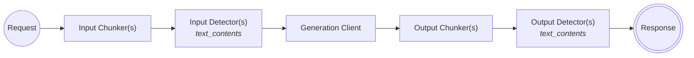
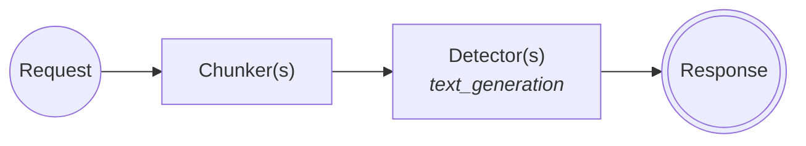
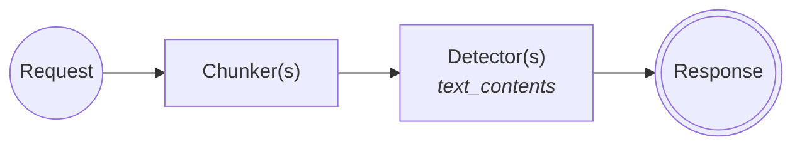
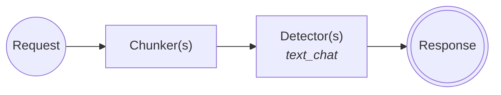
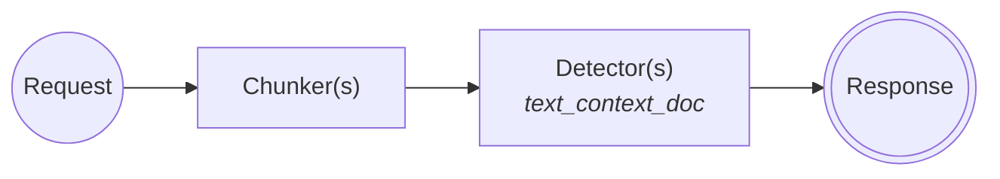

# Open questions

* How to mock gRPC clients? - [wiremock-grpc](https://crates.io/crates/wiremock-grpc) is not updated regularly
* Will we support "Bring Your Own Chunker"? If so...
  * Do we have an API for that?
  * We would need to add tests for wrongly implemented chunkers.

# Generation and detection

## /api/v1/task/classification-with-text-generation (unary)

**Test cases**

1. Input Chunker returns an error
2. Input detector returns error
	- 404
	- 503
	- 500
	- 422
3. Input detector returns a response that's not in the expected format (wrongly implemented detector)
4. Generation returns an error (what errors?)
5. Same as 1, but for output chunker
6. Same as #2, but for output detectors
7. Same as #3, but for output detectors

## /api/v1/task/server-streaming-classification-with-text-generation (streaming)

**Test cases**

1. Input Chunker returns an error
2. Input detector returns error
	- 404
	- 503
	- 500
	- 422
3. Input detector returns a response that's not in the expected format (wrongly implemented detector)
4. Generation returns an error (what errors?)
5. Same as 1, but for output chunker
6. Same as #2, but for output detectors
7. Same as #3, but for output detectors

## /api/v2/text/generation-detection

**Test cases**

1. Generation returns an error (what errors?)
2. Chunker returns an error
3. Detector returns error
	- 404
	- 503
	- 500
	- 422
4. Detector returns a response that's not in the expected format (wrongly implemented detector)

# Detection only

## /api/v2/text/detection/content

**Test cases**

1. Chunker returns an error
2. Detector returns error
	- 404
	- 503
	- 500
	- 422
3. Detector returns a response that's not in the expected format (wrongly implemented detector)

## /api/v2/text/detection/chat

**Test cases**

1. Chunker returns an error
2. Detector returns error
	- 404
	- 503
	- 500
	- 422
3. Detector returns a response that's not in the expected format (wrongly implemented detector)

## /api/v2/text/detection/context

**Test cases**

1. Chunker returns an error
2. Detector returns error
	- 404
	- 503
	- 500
	- 422
3. Detector returns a response that's not in the expected format (wrongly implemented detector)

## /api/v2/text/detection/generated

**Test cases**

1. Chunker returns an error
2. Detector returns error
	- 404
	- 503
	- 500
	- 422
3. Detector returns a response that's not in the expected format (wrongly implemented detector)